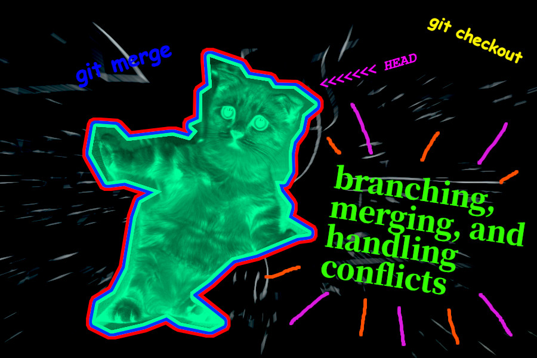

# Software Engineering: Lab 1
[Karl Johnson](https://github.com/hirekarl)  
PS 2025-RTT-30  
<date datetime="2025-06-03">2025-06-03</date> 



## Scenario: Branching, Merging, and Handling Conflicts
You are part of a development team at a tech company that is building a new website for a client. Each member of the team is responsible for different sections of the website, such as the navigation bar, footer, hero section, and contact form. To ensure that your work does not interfere with other developers’ work and vice versa, you will use Git branching and merging to work on your assigned features in isolation and then integrate them back into the main project.

Your project manager has asked you to:

- Work on specific features independently using branches.
- Merge your changes back into the main branch once your features are completed.
- Resolve any merge conflicts that arise during the process.

Once you have completed the guided features, you will be tasked with working on additional features of the website, just like you would in a real-world team project.

### Submission Summary
&rarr; Enter at [`index.html`](./index.html). Viewable at [fabulous-clafoutis-b18bb1.netlify.app](https://fabulous-clafoutis-b18bb1.netlify.app/).

#### Repo Structure
```
|-- .gitignore
|-- index.html
|-- README.md
|-- img
|   |-- customer.jpg
|   `-- hero.jpg
`-- static
    `-- css
        `-- main.css
```

#### Attributions
- Photo by Tranmautritam: https://www.pexels.com/photo/cute-tabby-kitten-on-a-sofa-2194261/
- Photo by Photo By: Kaboompics.com: https://www.pexels.com/photo/blackboard-with-handwritten-calculations-6256066/
- Photo by Andrea Piacquadio: https://www.pexels.com/photo/man-in-red-button-up-shirt-smiling-3777946/

### Questions
1. I merged each feature branch to `main` after each task on the assignment. Was that correct, or was I supposed to wait to merge branches to `main` only after I'd completed work on each individual branch?
2. How would I set my branches up if I found I wanted to make another change to the navigation bar after moving on from that commit? Would I make a new branch name, or is there a way to fast-forward `feature/navigation-bar` so that I can resume work on that feature with the newly applied commits?